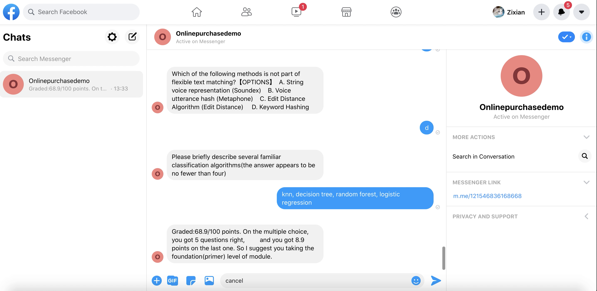

CONTENTS OF THIS PROJECT
------------

**Project Title:** A Purchase Service Chatbot for Online Courses

**Student Name:** Zixian Wang

 * Files Structure
 * Introduction
 * Deploying the Bot
  * Amazon Lex
  * Lambda Function
  * Files to S3 Bucket & DynamoDB  
 * Publish the Bot
 * Using the Bot
 
 

Files Structure
------------
```
.
├── Bot
├── Intents
├── Slots
├── lambda_function
│   ├── cancelAccount
│   ├── getCancel
│   ├── getDefinition
│   ├── getModule
│   ├── myOrder
│   ├── mytest
│   └── newUser
└── src
│   ├── ModuleInfo.csv
│   └── S3
│       ├── lookup-bucket-1
│       └── qzbucket-test
│
└── layer-requests.zip
```


Introduction
------------
This chatbot project is based on Amazon lex. Its main purpose is to provide online course purchase services for users on machine learning domain, and can also provide users with different knowledge background of the ability test. With the placement test, It can be automated graded. Depending on the difficulty of each set of questions (i. e. passing points) , users may be assigned to primer or advanced classes.


Deploying the Bot
----------------


**Amazon Lex**

The JSON format file in the _Intents_ and _Slots_ folder is used to create the lex bots.

**Lambda Function**

The intent in Amazon lex corresponds to the required lambda function(Python 3.8), and the following table shows the correspondence between the Intents' name and the folders' name.

|  _Intents_  | _Lambda Function_   |_Description_|
| ---- | ---- |---|
|  AllocatedModule | mytest  | The main function of the placement test. The [text similarity API](https://aws.amazon.com/marketplace/pp/twinword-inc-Text-Similarity-API/B071G93T67) is used in the function that contributes to the calculation of scores. |
|  BookModule | getModule |Recommendations and order feedback when a user intends to purchase a course|
| CancelModule| getCancel |Triggered when the user applies for cancellation of the order|
| CloseAccount| cancelAccount |Triggered when the user applies for cancellation of his/her account.|
| CloseItent  | --- |Triggered when the user tries to change the topic.|
| FAQs  | --- |When user ask the chatbot for help.|
| GetDefinition  | getDefinition |Get the meaning of the academic terms on machine learning domain.|
| Greeting  | newUser |Sign up|
| UserOrder | myOrder |When a user queries his/her order.|

In particular, we still need to add another layer to mytest's function, which is to import **layer-requests.zip** file, and is triggered when deploying.


**Files to S3 Bucket & DynamoDB**

The file is in the SRC directory. The following table shows what the CSV file represents:


|  _csvFiles_  |_Description_|
| ---- | ---- |
| MLglossary.csv |Academic terms on machine learning domain and are the data is collected from website <https://developers.google.com/machine-learning/glossary>|
| ModuleInfo.csv | The course information table is stored in DynamoDB with M-id as the primary key |
| deep learning.csv | questions set|
| machine learning.csv | questions set |
| data analysis.csv | questions set|
| nlp.csv | questions set|


Publish the Bot 
-----------------
In my project, I used Facebook Messenger as an object for publishing the chatbot.
Amazon lex is easy to deploy and is available on four platforms: Facebook, Kik, Slack, and Twilio SMS.

Take Messenger as an example, channels requires two important properties. They are _Page Access Token_ and _APP Secret Key_. For Messenger, it need to fulfill the Callback URL field in the settings.

Chatbot on Messenger
-------------

PATH ./images/onlinepurchasedemo.png




Reference
-------------
The [encryption](https://gist.github.com/JohnPreston/6c6dcd0e726219a10111182891f8547b) and [decryption](https://gist.github.com/JohnPreston/e98e5cfcc62b2236815574a84e58b42b) methods in *KMS.py* file of Preston, Johnis cited in the project.


 